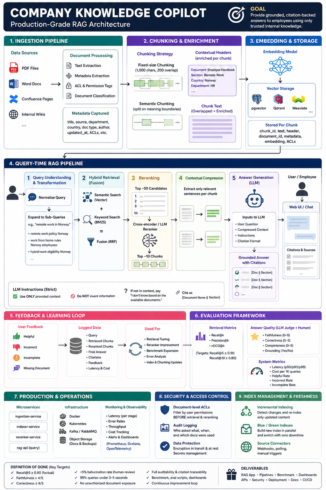

# Company Knowledge Copilot

Production-grade RAG system for answering employee questions against internal company documentation with grounded, citation-backed answers.

## System Overview



## Architecture

```
Employee Query
      │
      ▼
┌─────────────────────────────────────────────────────┐
│                    RAG Pipeline                      │
│                                                     │
│  1. Query Expansion (Claude: 3-5 rewrites)          │
│  2. Hybrid Retrieval                                │
│     ├── Semantic  (Qdrant cosine, top-50)           │
│     ├── Keyword   (BM25, top-50)                    │
│     └── Fusion    (Reciprocal Rank Fusion)          │
│  3. ACL Filter   (before reranking)                 │
│  4. Reranking    (Cross-Encoder, top-50 → top-10)   │
│  5. Compression  (Claude extracts relevant text)    │
│  6. Generation   (Claude + citation instructions)   │
└─────────────────────────────────────────────────────┘
      │
      ▼
Answer + [Document § Section] citations
```

## Stack

| Layer | Technology |
|---|---|
| LLM | Anthropic Claude (claude-sonnet-4-6) |
| Embeddings | sentence-transformers/all-MiniLM-L6-v2 |
| Vector Store | Qdrant |
| Keyword Search | BM25 (rank-bm25) |
| Reranker | cross-encoder/ms-marco-MiniLM-L-6-v2 |
| API | FastAPI + uvicorn |
| Frontend | Single-page HTML/Tailwind |
| Observability | Prometheus + structlog |
| Container | Docker + Docker Compose |

## Quick Start

```bash
# 1. Copy env file and fill in your Anthropic key
cp .env.example .env

# 2. Start Qdrant + API
docker compose up -d

# 3. Ingest documents
python -m scripts.build_index --source data/raw_docs --department HR

# 4. Open the UI
open http://localhost:8000/ui
```

## Running locally (no Docker)

```bash
pip install -r requirements.txt

# Start Qdrant separately (Docker)
docker run -p 6333:6333 qdrant/qdrant

# Start API
uvicorn backend.app:app --reload --port 8000
```

## API Endpoints

| Method | Path | Description |
|---|---|---|
| `POST` | `/api/v1/query` | Query with full response |
| `POST` | `/api/v1/query/stream` | SSE streaming query |
| `POST` | `/api/v1/feedback` | Submit answer feedback |
| `GET` | `/api/v1/documents` | List indexed documents |
| `POST` | `/api/v1/ingest` | Ingest a document |
| `GET` | `/api/v1/health` | Health check |
| `GET` | `/metrics` | Prometheus metrics |

### Query request

```json
{
  "query": "What is the remote work policy in Norway?",
  "user_id": "alice@company.com",
  "user_groups": ["hr-team", "engineering"],
  "top_k": 5
}
```

### Query response

```json
{
  "query_id": "...",
  "answer": "Employees in Norway may work remotely up to 3 days per week... [Employee Handbook § Remote Work]",
  "citations": [
    {
      "document_title": "Employee Handbook",
      "section": "Remote Work",
      "relevant_text": "Employees may work from home up to 3 days per week...",
      "score": 0.94
    }
  ],
  "query_rewrites": ["remote work policy Norway", "work from home Norway employees"],
  "latency_ms": { "total_ms": 1840, "retrieval_ms": 120, "generation_ms": 1200 }
}
```

## Document Ingestion

```bash
# Single PDF
python -m scripts.build_index --file data/raw_docs/handbook.pdf --type pdf --department HR

# Full directory
python -m scripts.build_index --source data/raw_docs --department Engineering

# With ACL groups (restrict to specific teams)
python -m scripts.build_index --file comp_guide.pdf --acl-groups hr-team managers

# Rebuild BM25 index from Qdrant
python -m scripts.build_index --rebuild-bm25
```

Supported document types: `pdf`, `docx`, `confluence`, `wiki`/`html`

## Evaluation

```bash
# Run full evaluation suite
python -m scripts.run_evaluation --eval-set data/eval_set.jsonl

# Output
EVALUATION SUMMARY
Total questions:      100
Avg Recall@5:         0.924  (target ≥ 0.90) ✓
Avg Faithfulness:     4.2/5  (target ≥ 4.0)  ✓
Avg Correctness:      4.1/5  (target ≥ 4.0)  ✓
Hallucination rate:   2.1%   (target < 5%)   ✓
```

### Eval set format (data/eval_set.jsonl)

```json
{
  "question": "What is the remote work policy in Norway?",
  "gold_answer": "Employees may work remotely up to 3 days per week.",
  "supporting_chunk_ids": ["chunk_abc123"],
  "difficulty": "simple",
  "department": "HR"
}
```

Difficulty levels: `simple` | `multi_section` | `ambiguous`

## Tests

```bash
pytest tests/ -v --cov=backend --cov-report=term-missing
```

## ACL (Access Control)

Every chunk carries an `acl_groups` list. At query time:

- **Empty list** → publicly accessible to all authenticated users
- **Non-empty list** → only users whose groups intersect are served the chunk

ACL filtering happens **before** reranking and generation — no unauthorised content ever reaches the LLM context.

Set groups at ingestion time:

```bash
python -m scripts.build_index --file salary_bands.pdf --acl-groups hr-team managers finance
```

Pass user groups in the request header or body:

```
X-User-Groups: hr-team,managers
```

## Production Readiness Checklist

- [x] Hybrid retrieval (semantic + BM25 + RRF)
- [x] Cross-encoder reranking
- [x] Contextual compression
- [x] Prompt caching (Anthropic ephemeral cache)
- [x] ACL document filtering
- [x] Streaming SSE responses
- [x] Feedback capture (helpful / incorrect / incomplete)
- [x] Query audit logging
- [x] Prometheus metrics (`/metrics`)
- [x] Structured logging (structlog)
- [x] Docker Compose deployment
- [x] Evaluation framework (Recall@k, nDCG, faithfulness, correctness)
- [x] Incremental BM25 index updates
- [x] Honest "I don't know" fallback when context lacks an answer
